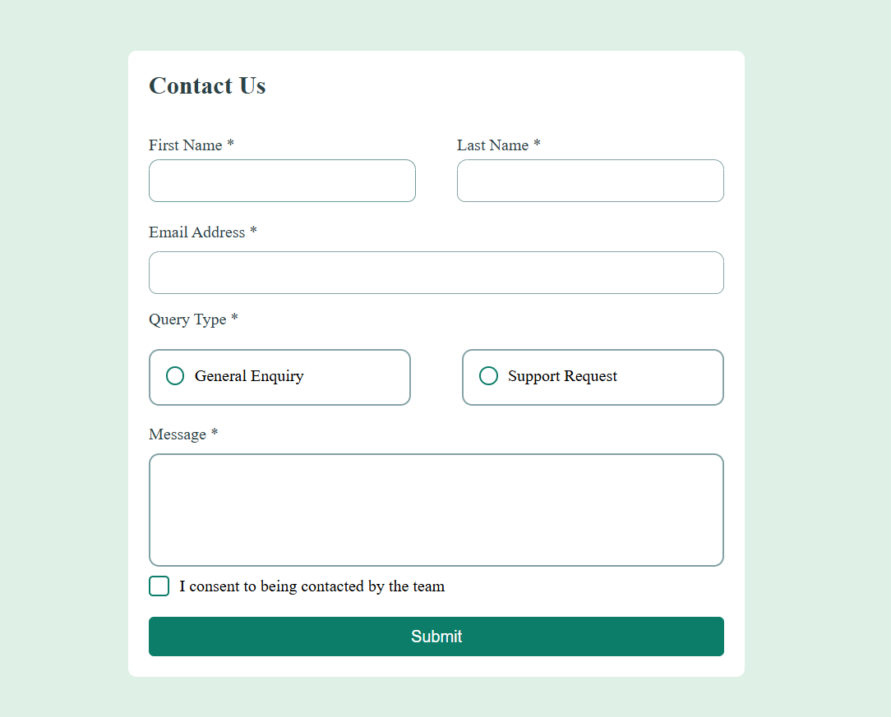
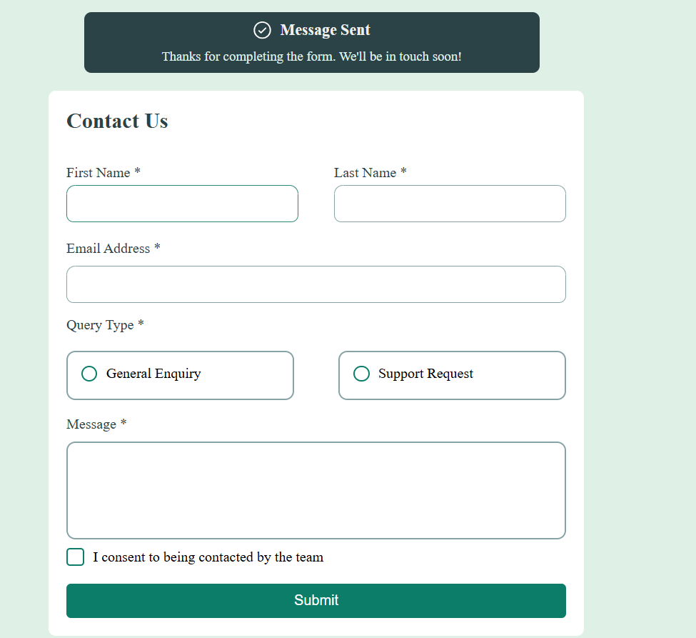
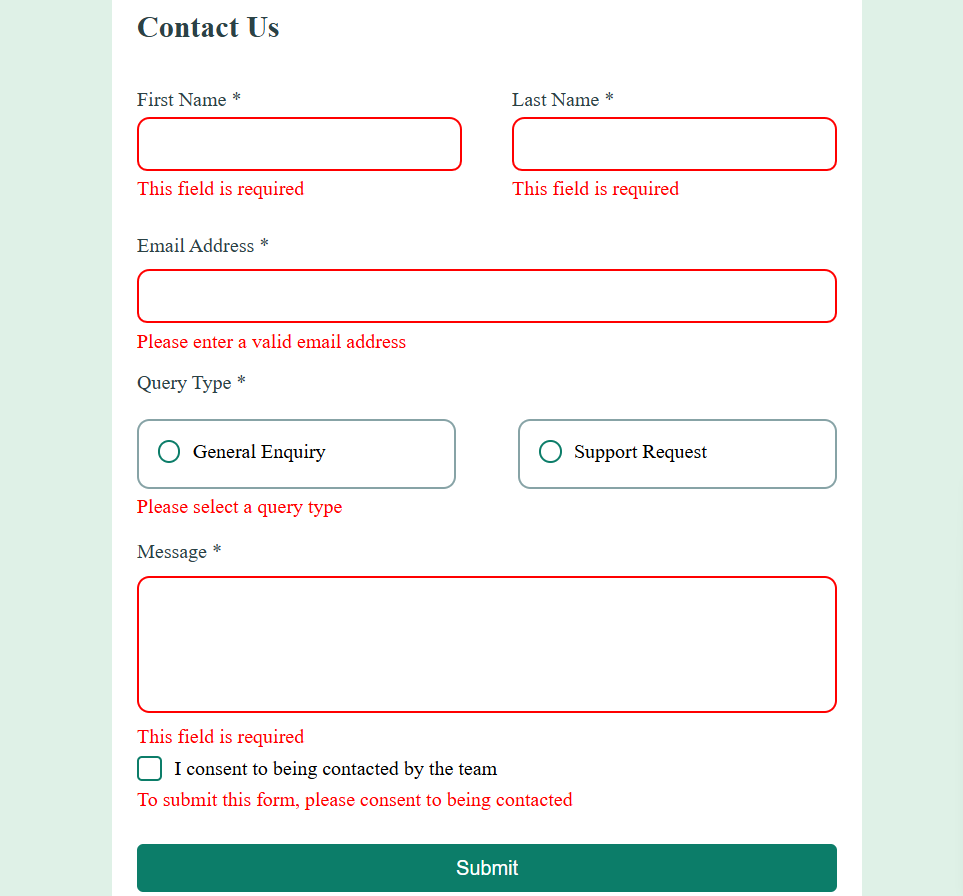

# Frontend Mentor - Contact form solution

This is a solution to the [Contact form challenge on Frontend Mentor](https://www.frontendmentor.io/challenges/contact-form--G-hYlqKJj). Frontend Mentor challenges help you improve your coding skills by building realistic projects. 

## Overview

### The challenge

Users should be able to:

- Complete the form and see a success toast message upon successful submission
- Receive form validation messages if:
  - A required field has been missed
  - The email address is not formatted correctly
- Complete the form only using their keyboard
- Have inputs, error messages, and the success message announced on their screen reader
- View the optimal layout for the interface depending on their device's screen size
- See hover and focus states for all interactive elements on the page

### Screenshot

;
;
;

### Links

- Solution URL: (https://github.com/SaquibFurniturewala1/Frontend-Mentor-Contact-Form);
- Live Site URL: (https://saquibfurniturewala1.github.io/Frontend-Mentor-Contact-Form/);

## My process

### Built with

- Semantic HTML5 markup
- CSS custom properties
- Flexbox
- CSS Grid
- JavaScript
- Mobile-first workflow

### What I learned

I learned how to create a form with validation and also how to make the site responsive using media queries.

### Continued development

I aim to explore more complex form validation techniques and deepen my understanding of responsive design, ensuring that my site provides an optimal user experience on all devices.

## Author

 - Frontend Mentor - https://www.frontendmentor.io/profile/SaquibFurniturewala1

## Acknowledgments

A special thanks to Frontend Mentor for providing the opportunity to work on real-world projects and enhancing my skills through hands-on challenges.